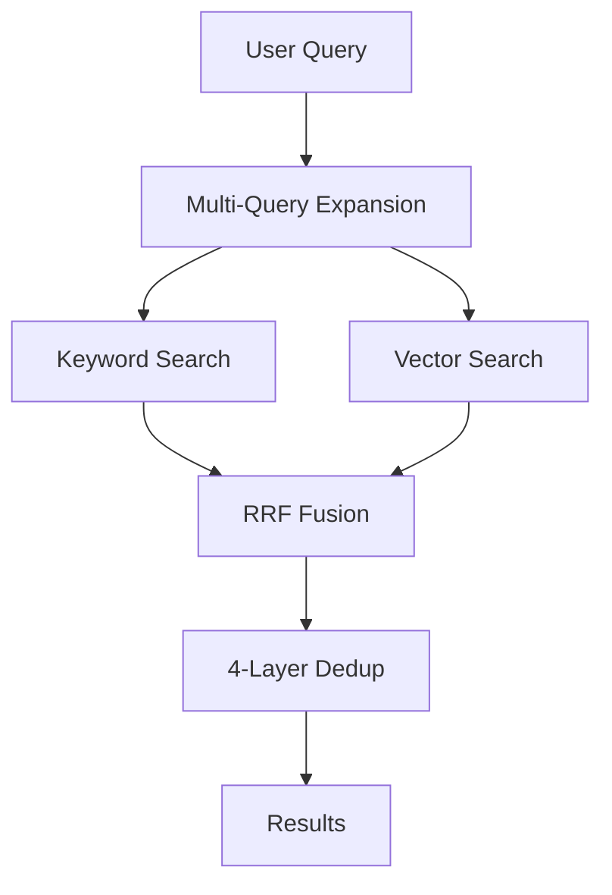

## Overview / 概要

SHOGUN's search pipeline combines **keyword search** (full-text via tsvector) and **vector search** (semantic via pgvector HNSW) using **Reciprocal Rank Fusion (RRF)** for best-of-both-worlds retrieval.

SHOGUNの検索パイプラインは、**キーワード検索**（tsvectorフルテキスト）と**ベクトル検索**（pgvector HNSWセマンティック）を**Reciprocal Rank Fusion (RRF)**で組み合わせ、両方の長所を活かした検索を実現します。

## Pipeline Flow / パイプラインフロー



## Step 1: Multi-Query Expansion / マルチクエリ展開

The original query is expanded into multiple search queries for better recall.

元のクエリが、より広いリコールのために複数の検索クエリに展開されます。

- **Heuristic**: Extracts key terms, removes stopwords (no API needed)
- **LLM-powered**: Uses Claude Haiku to generate semantically diverse queries

## Step 2: Keyword Search / キーワード検索

Uses PostgreSQL's built-in `tsvector` + `ts_rank_cd` for full-text search with weighted fields:

- **Weight A**: Page title (highest)
- **Weight B**: Compiled truth
- **Weight C**: Timeline

## Step 3: Vector Search / ベクトル検索

Uses pgvector's **HNSW index** for fast approximate nearest neighbor search on text-embedding-3-large vectors (3072 dimensions).

<Note>
Vector search requires an OpenAI API key. Without it, only keyword search is available.

ベクトル検索にはOpenAI APIキーが必要です。なしでもキーワード検索は利用可能です。
</Note>

## Step 4: RRF Fusion / RRF融合

Reciprocal Rank Fusion combines results from both search methods:

```
score = Σ 1/(K + rank)    where K = 60
```

Pages appearing in **both** result sets get boosted scores (`match_type: "hybrid"`).

## Step 5: 4-Layer Dedup / 4層重複排除

1. **Best chunk per page**: Keep only the highest-scoring chunk per page
2. **Near-duplicate removal**: Remove results with text similarity > 0.85
3. **Type diversity**: Cap any single type at 60% of results
4. **Per-page chunk cap**: Maximum 3 chunks per page

## Usage / 使い方

```typescript
// Full hybrid search
const results = await brain.searchPipeline.query({
  query: "Who did I meet today?",
  limit: 10,
  type_filter: ["person", "session"],
});

// Keyword-only search (no API key needed)
const results = await brain.searchPipeline.keywordOnly("meeting notes", 20);
```
