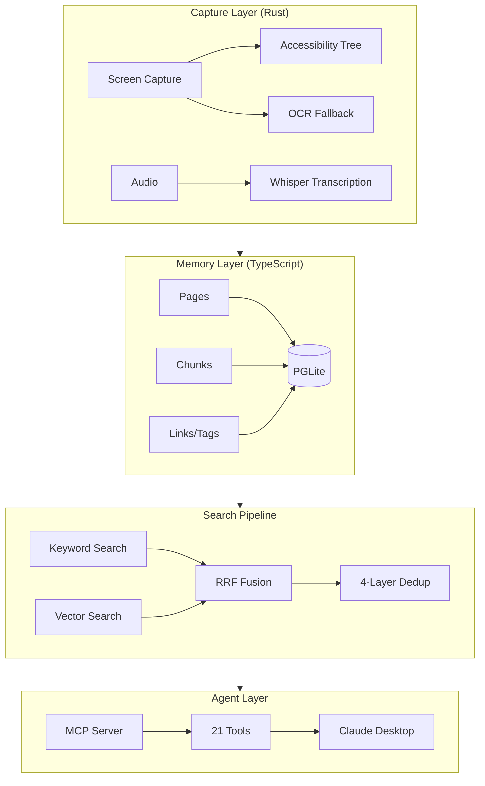

## What is SHOGUN Memory Layer?

SHOGUN Memory Layer is a **local-first, AI-native memory system** that captures everything you see and do on your computer, structures it into searchable knowledge, and makes it available to AI agents.

SHOGUN Memory Layerは、**ローカルファーストのAIネイティブメモリシステム**です。コンピュータ上で見たこと・したことを全てキャプチャし、検索可能な知識に構造化し、AIエージェントに提供します。

<CardGroup cols={2}>
  <Card
    title="Quick Start"
    icon="rocket"
    href="/quickstart"
  >
    Get up and running in under 5 minutes.
    5分以内にセットアップ完了。
  </Card>
  <Card
    title="MCP Tools"
    icon="wrench"
    href="/mcp-tools/overview"
  >
    21 tools for AI agent integration.
    AIエージェント連携のための21ツール。
  </Card>
  <Card
    title="Search Pipeline"
    icon="magnifying-glass"
    href="/concepts/search"
  >
    Hybrid search with keyword + vector + RRF fusion.
    キーワード+ベクトル+RRF融合のハイブリッド検索。
  </Card>
  <Card
    title="Cost Optimization"
    icon="coins"
    href="/concepts/cost-optimization"
  >
    Tiered models, embedding cache, and more.
    段階的モデル選択、埋め込みキャッシュなど。
  </Card>
</CardGroup>

## Why SHOGUN?

| Existing Solutions | Problem | SHOGUN |
|---|---|---|
| Screenpipe | Requires build, paid plugins, unstable | One-click install |
| Rewind AI | Cloud-dependent, privacy concerns | All data stored locally |
| Notion AI / Obsidian | Requires manual input | Automatic capture |
| Apple Intelligence | Ecosystem lock-in | Cross-platform |

## Architecture Overview

## Key Features

<AccordionGroup>
  <Accordion title="Local-First / ローカルファースト">
    All data is stored locally using PGLite (Postgres WASM). No cloud dependency. Your data never leaves your machine unless you explicitly choose to sync.

    全データはPGLite（Postgres WASM）を使用してローカルに保存。クラウド依存なし。明示的に同期を選択しない限り、データはマシンから出ません。
  </Accordion>

  <Accordion title="AI-Native Memory / AIネイティブメモリ">
    Every piece of information is automatically chunked, embedded, and indexed for AI retrieval. The memory grows and evolves through the nightly Dream Cycle.

    すべての情報が自動的にチャンク化、埋め込み、インデックス化されAI検索に最適化。Dream Cycleによりメモリは毎晩成長・進化します。
  </Accordion>

  <Accordion title="BYOK / 自分のAPIキーを使う">
    Bring Your Own Key — use your own OpenAI or Anthropic API keys. No vendor lock-in. Optional local models via Ollama for complete offline operation.

    BYOK — 自分のOpenAIまたはAnthropic APIキーを使用。ベンダーロックインなし。Ollamaによるローカルモデルでの完全オフライン動作もオプション。
  </Accordion>

  <Accordion title="21 MCP Tools / 21のMCPツール">
    Full integration with Claude Desktop and other MCP-compatible AI agents through 21 specialized tools covering read, write, and admin operations.

    21の専門ツール（読取・書込・管理）を通じて、Claude Desktopおよび他のMCP対応AIエージェントと完全統合。
  </Accordion>
</AccordionGroup>
